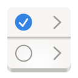
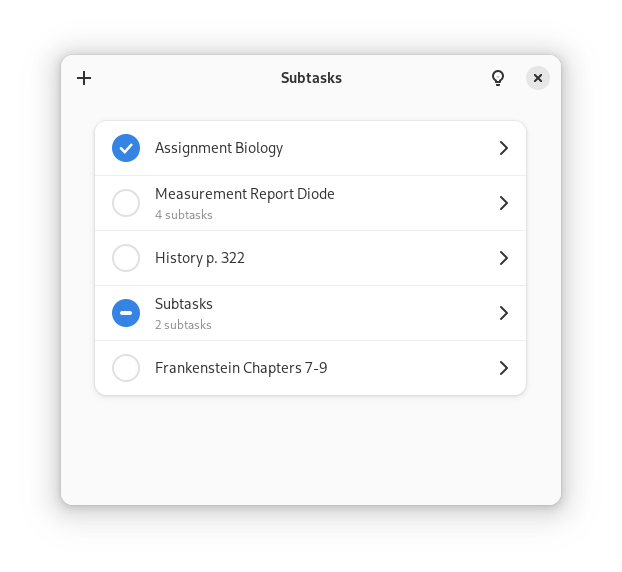

  
  <h1 align="center">Subtasks</h1>

_Subtasks_ is a very simple task management app for GNOME.

## Table of Contents

- [Installation](#Installation)
- [Localization](#Localization)
- [Thanks](#Thanks)

## Installation

Download the Flatpak file from the latest release, open it in GNOME Software and press the install button.

## Localization

Translations are welcome! You can either edit the [Localized.yml file](Sources/Localized.yml) directly as YAML, or install the [Localizer](https://github.com/AparokshaUI/Localizer) app and translate via a UI.

Either way, commit the changes via git and open a pull request.

## Thanks

### Dependencies
- [Adwaita for Swift](https://github.com/AparokshaUI/Adwaita) licensed under the [MIT License](https://github.com/AparokshaUI/Adwaita/blob/main/LICENSE.md)
- [Localized](https://github.com/AparokshaUI/Localized) licensed under the [MIT License](https://github.com/AparokshaUI/Localized/blob/master/LICENSE.md)

### Other Thanks
- The [contributors](Contributors.md)
- [SwiftLint](https://github.com/realm/SwiftLint) for checking whether code style conventions are violated
- The programming language [Swift](https://github.com/apple/swift)
- [Libadwaita](https://gnome.pages.gitlab.gnome.org/libadwaita/doc/1.4/) and [GTK](https://docs.gtk.org/gtk4/) for the UI widgets
- [GNOME Builder](https://apps.gnome.org/Builder/) and many other apps

